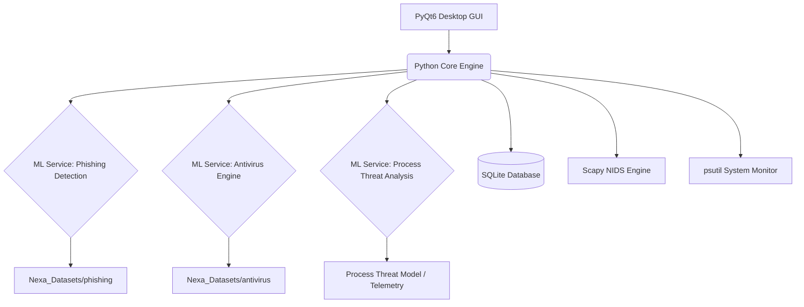

# NexaShield App

## 🛡️ Advanced CyberSecurity Defense System

NexaShield is a cutting-edge cybersecurity defense system designed to provide robust protection against a wide array of digital threats, including sophisticated phishing attacks and various forms of malware. Leveraging advanced machine learning models and a modular architecture, NexaShield aims to offer real-time threat detection, analysis, and prevention capabilities. This project is hosted on GitHub: https://github.com/git-atharvb/nexashield-app.git

---

## Table of Contents

1.  [Introduction](#1-introduction)
2.  [Features](#2-features)
3.  [Architecture Overview](#3-architecture-overview)
4.  [Technology Stack](#4-technology-stack)
5.  [Modules and Components](#5-modules-and-components)
6.  [Machine Learning Models and Datasets](#6-machine-learning-models-and-datasets)
    *   [Process Threat Model Details](#process-threat-model-details)
    *   [Antivirus Model Details](#antivirus-model-details)
    *   [Phishing Detection Model Details](#phishing-detection-model-details)
7.  [Design and Styling](#7-design-and-styling)
8.  [Installation and Setup](#8-installation-and-setup)
9.  [Usage & Developer Guide](#9-usage--developer-guide)
10. [Contributing](#10-contributing)
11. [License](#11-license)

---

## 1. 🚀 Introduction

In an increasingly interconnected world, digital security is paramount. NexaShield addresses this critical need by offering an intelligent, adaptive desktop defense system. It integrates multiple threat detection mechanisms—ranging from ML-based phishing and malware detection to real-time network packet sniffing and active OS-level firewall prevention. Our goal is to empower users and organizations with a proactive, unified threat management suite against evolving cyber threats.

## 2. ✨ Features

*   **Real-time Phishing Detection** 🎣: Analyzes URLs and web content to identify and block phishing attempts. This feature helps protect users from fraudulent websites designed to steal credentials or sensitive information by scrutinizing various URL characteristics and page content.
*   **Advanced Antivirus Scanning** 🦠: Detects and neutralizes various types of malware, including viruses, worms, and Trojans. It employs sophisticated machine learning techniques to identify malicious code and behavioral patterns in files and processes.
*   **Machine Learning Powered** 🧠: Utilizes sophisticated ML models for accurate and adaptive threat identification. Our models are continuously trained on vast and diverse datasets to recognize new and emerging threats, reducing reliance on static signatures.
*   **Network Intrusion Detection & Prevention (NIDS/IPS)** 🚨: Live packet capture and Deep Packet Inspection (DPI) powered by Scapy. Includes Snort-style rules to identify network scans, payloads, and automatically block malicious IPs at the OS firewall level.
*   **Real-time Process & Memory Monitoring** ⚡: Track, suspend, or terminate suspicious system processes. Monitor live CPU/RAM utilization, inspect disk partitions, check S.M.A.R.T health status, and easily clean temporary files.
*   **SIEM Dashboard** 📊: A centralized command center summarizing device health, active telemetry (animated histograms), and aggregating recent security events into a single actionable feed.
*   **Modular Design** 🧩: Allows for easy expansion and integration of new security features. This architecture ensures scalability, maintainability, and the ability to rapidly adapt to new threat landscapes and incorporate additional security modules.
*   **User-friendly GUI** 🖥️: Built with PyQt6, providing a highly responsive, modern desktop interface with interactive graphs, customizable tables, and a seamless user experience.
*   **Comprehensive Reporting** 📑: Effortlessly export live process lists, network packet captures (PCAP), and scan histories to PDF or CSV formats for forensic analysis.

## 3. 🏛️ Architecture Overview

NexaShield is designed as a powerful modular Desktop Application, seamlessly integrating a locally hosted Python backend with a rich graphical interface.

*   **Graphical User Interface (GUI)** 🌐: Developed using PyQt6, it handles user interaction, interactive telemetry charting, and configuration panels.
*   **Core Logic Engines** ⚙️: Multi-threaded Python workers utilizing libraries like `psutil` (for system metrics) and `scapy` (for deep packet inspection).
*   **Machine Learning Integration** 🧠: ML models for Antivirus, Process Threat Detection, and Phishing detection load locally or communicate with microservices to deliver high-performance inferences.
*   **Local Database** 🗄️: Uses local SQLite (`nexashield.db`) to log real-time events, threat history, and maintain signature databases locally.

### Working Synopsis 



## 4. 🛠️ Technology Stack

*   **Desktop Framework**: PyQt6 (Python GUI).
*   **Networking & Sniffing**: Scapy.
*   **System Telemetry**: psutil, OS-level WMI/bash calls.
*   **Machine Learning**: Scikit-learn, Pandas, NumPy, TensorFlow/PyTorch.
*   **Data Serialization**: `pickle` (`.pkl` files), JSON.
*   **Database**: SQLite (`nexashield.db`).
*   **PDF Generation**: PyQt6 `QtPrintSupport`.

## 5. 🧩 Modules and Components

NexaShield is structured into distinct modules to manage different aspects of cybersecurity.

### Antivirus Module
This module is responsible for detecting and identifying malicious software. It integrates with the core system to scan files, processes, and system behavior for known and emerging threats.

### Phishing Detection Module
Focused on web-based threats, this module analyzes URLs, website content, and network traffic patterns to identify and warn users about phishing attempts, protecting them from credential theft and other social engineering attacks.

### Network Intrusion Detection (NIDS)
Sniffs network traffic across all interfaces to intercept malicious packets. Features deep packet inspection, rule-based signature matching (similar to Snort), and active blocking of dangerous IP addresses using the OS's native firewall.

### Process & Memory Management
Provides detailed insight into system performance, allowing users to track down high CPU/RAM consumers, terminate suspicious activities, evaluate storage health (S.M.A.R.T), and reclaim memory by safely clearing temp files. Features a dynamic explainability engine.

### SIEM Dashboard
A global overview aggregating device telemetry (histograms and donut charts for CPU/RAM/Disk), system health checks, and a consolidated feed of security alerts coming from all other active modules.

## 6. 🧠 Machine Learning Models and Datasets

The core intelligence of NexaShield lies in its machine learning models, trained on extensive and diverse datasets.

### Process Threat Model Details

The NexaShield Processes Module employs a localized Random Forest Regressor (`scikit-learn`) acting as a Behavioral Analysis Engine, inspecting live telemetry to flag potentially malicious activity.

*   **Why Random Forest?** Handles non-linear relationships (High CPU + Temp Directory + Network), robust to OS noise, and extremely fast (fractions of a millisecond per process).
*   **Features:** Evaluates `cpu_percent`, `memory_percent`, `thread_count`, `is_system_user`, `is_temp_path` (high-value indicator), `is_appdata_path`, and `has_network`.
*   **Dataset:** Trained on a 15,000 sample custom Synthetic Telemetry Generator, with dynamic threat weighting and stochastic noise.
*   **Bucketing & UI:** Maps threat level into five actionable UI colors (Safe/Green to Critical/Red), and dynamic forensics explain exactly which flags triggered the AI.

### Antivirus Model Details

The Antivirus module employs a supervised machine learning approach to classify files or system activities as benign or malicious.

*   **Datasets Used (`Nexa_Datasets/antivirus/`)**:
    *   `data.csv`: Features extracted from files (API calls, file structure, entropy).
    *   `labels.txt`: Class labels.
    *   `df_file_extensions.csv` & `REWEMA.csv`: Risk scores and behavior indicators.
    *   `vectorizer.pkl`: Serialized vectorizer for features.
*   **Working of the ML Model**: Extracts features from files, vectorizes them via `vectorizer.pkl`, and uses a trained classification model to detect real-time threats.

### Phishing Detection Model Details

The Phishing Detection module utilizes machine learning to identify and block malicious URLs and web content.

*   **Datasets Used (`Nexa_Datasets/phishing/`)**:
    *   `merged_url_datasets.csv`, `phishind_dataset.csv`, `synthetic_phsihing_dataset.csv`: Diverse collections of labeled URLs.
    *   `malicious_code_links_finidngs_v1.json`: Extracted features like JS snippets and HTML structures.
    *   `phishing_model.pkl`: Serialized, pre-trained machine learning model.
*   **Working of the ML Model**: Extracts URL-based (length, IP, age) and content-based features, feeds them to `phishing_model.pkl` to predict legitimacy.

## 7. 🎨 Design and Styling

The project aims for a clean, intuitive, and responsive user interface.

*   **Design Principles**: Emphasis on clarity, ease of use, and quick access to critical security information. Clean visual cues (color-coded badges, gradients) highlight threats intuitively.
*   **Styling**: Integrated global Qt Stylesheets with dynamically swapping Light/Dark themes and interactive charting components (animated donuts and line graphs).

## 8. ⚙️ Installation and Setup

### Prerequisites
- **Python 3.8+** installed on your system.
- **Npcap/WinPcap** installed (Required for Scapy network sniffing on Windows).

### Steps
1. **Clone the repository:**
   ```bash
   git clone https://github.com/git-atharvb/nexashield-app.git
   cd nexashield-app
   ```
2. **Create a Virtual Environment (Optional but recommended):**
   ```bash
   python -m venv venv
   # On Windows
   venv\Scripts\activate
   # On Linux/macOS
   source venv/bin/activate
   ```
3. **Install Dependencies:**
   ```bash
   pip install -r requirements.txt
   ```

## 9. 💻 Usage & Developer Guide

### Standard Application Launch
To launch the application normally:
```bash
# Navigate to the project root, then run:
python modules/main.py
```

### Development & Hot-Reload
For UI development, you can use `watchdog` to automatically restart the application when Python files are modified.
```bash
watchmedo auto-restart --patterns="*.py" --recursive -- python modules/main.py
```
*Alternatively, you can just run `dev.bat` on Windows.*

### Testing the AI (Malware Simulator)
To test the behavioral AI, we provide a `malware_simulator.py` script. This script intentionally mimics malicious behavior (spikes CPU, opens Network Sockets, hides in Temp paths) without actually harming your PC.
```bash
python malware_simulator.py
```

### Retraining the AI Process Model
If you need to generate a new synthetic dataset and retrain the Random Forest model for the AI Process Scanner:
```bash
python modules/ai/processAI/train_process_model.py
```
*(This regenerates the `process_threat_model.pkl` and `process_threat_features.pkl` files).*

## 10. 🤝 Contributing

We welcome contributions to NexaShield! Please open issues or submit pull requests with bug fixes or new features. When contributing, please follow standard Python style guidelines and ensure any new module adheres to the existing PyQT6 integration patterns.

## 11. 📄 License

This project is licensed under the MIT License - see the `LICENSE` file for details.
